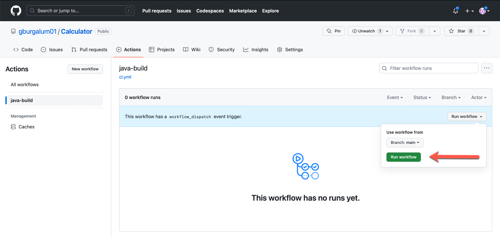
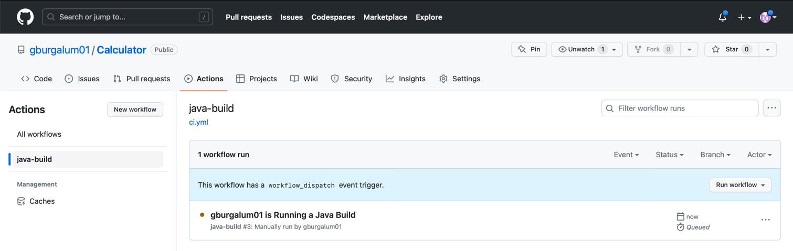
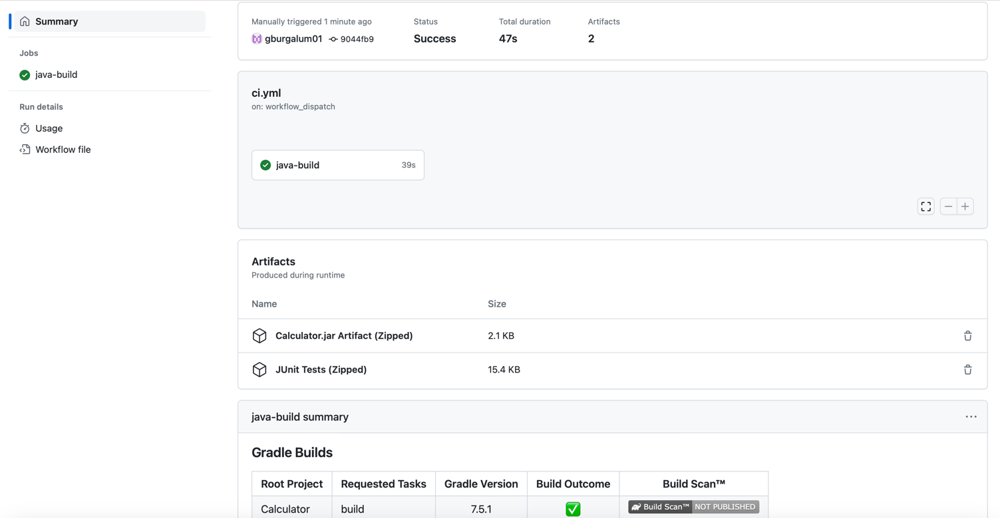
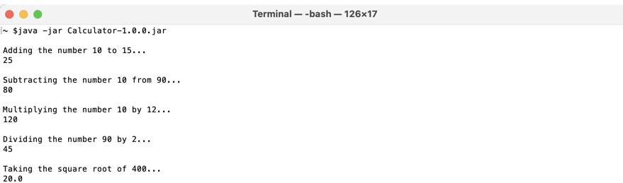

# Calculator

## Overview
This is a simple Java application that, when run, performs a series of mathematical computations.  The purpose of this project is to demonstrate how to use GitHub Actions to build the application JAR artifact using Gradle and upload it as an artifact to the GitHub Action workflow instance.

## Requirements
* JDK 11
* Gradle 7

## Building the Artifact Using GitHub Actions

On the Actions tab in the GitHub repository, click the workflow job named *java-build* on the left.  

As this particular job is set up to handle the *workflow_dispatch* event, it can be run manually.  Therefore, in the table containing the workflow runs, click the *Run workflow* button.  In the dialog shown, select *main* as the branch and click the *Run workflow* button.

The running job instance will display in the list.

After a minute, the job will complete.  Click on the workflow run.  The artifacts section will contain the JAR artifact as well as the results of running the JUnit tests as part of the build.

## Running the Application

The JAR file can be downloaded by clicking it in the Artifacts section of the workflow run summary page.  Assuming that you have a Java Runtime Environment of 11 or greater installed on your machine, run the command *java -jar Calculator-1.0.0.jar* in a terminal to run a few sample calculations.

